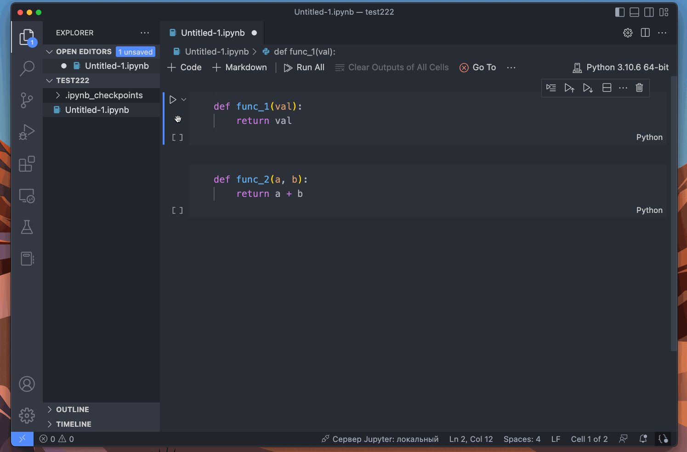

# Jupyter Extractor
Jupyter extractor allows you to extract your notebook code to separate python modules.

## Usage
You need to select some cells in your notebook to extract them. After selection you need to execute the "Extract Cell Code" command.

